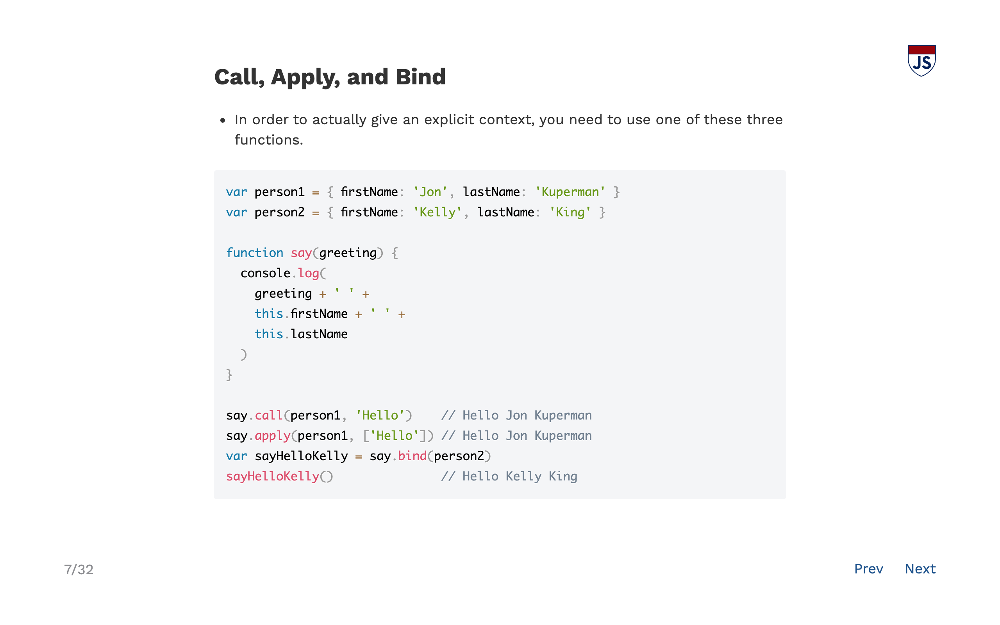

### Overview

The majority of the site is written in Markdown. Lectures are also written in Markdown with special syntax for adding class names to slides. I wrote a custom template to split these slides on `
` tags and render them in a browser in a way that looks like a normal slide deck. State is stored in query params so slides can be shared and saved.

