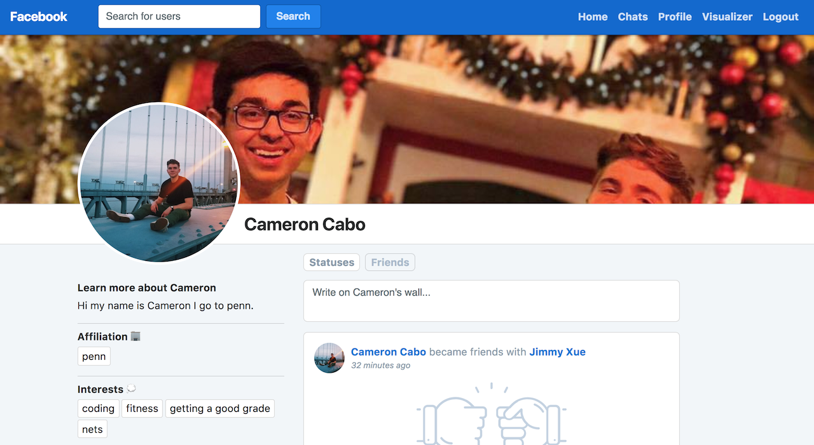

### Overview

Built out features for notifications, friending and unfriending, general posts, posts to walls, etc. Worked alongside two other project partners: Terry Jo and Victor Chien. Also built out view for visualizing graph of relationships.

