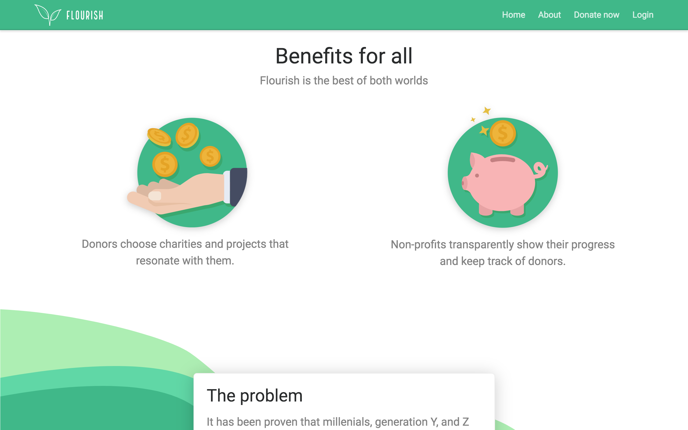

My friend Adam Ripley and I helped founder Braden Fineberg and his team in building out an MVP. You can think of Flourish as Acorns but for investing in causes you care about rather than your savings account.

After helping propel the company forward, they raised money. As they matured, Adam and I didn't have the bandwidth at the time to carry them to the next level, so we decided to step off and let the Fourish team carry on.

