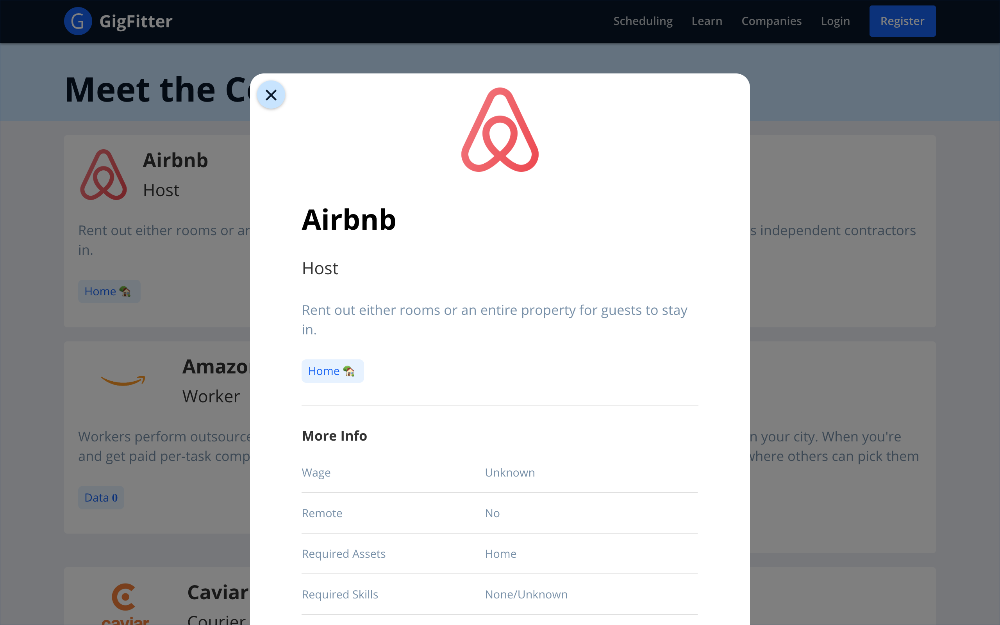
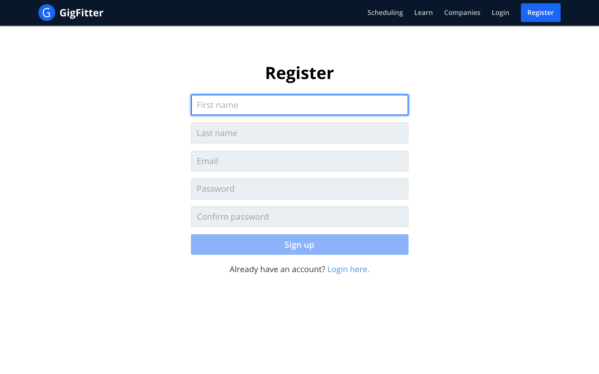
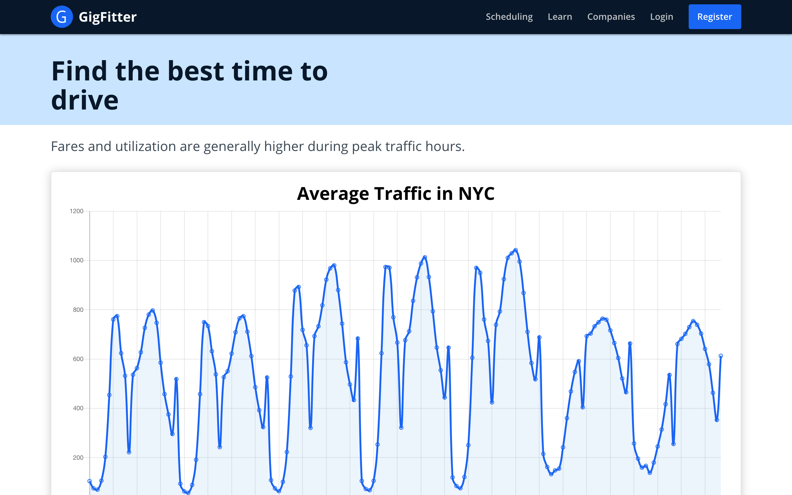

### Overview

In-progress project for CIS 400: Senior Design. We're trying to attack the problem that many people in the Gig Economy decide to supply labor in a greedy/satisficing manner. In the short run, this might make sense. However the reality is that many people work in gig economy jobs for a while but stick to their first decisions (who to work for, when to work, where to work, etc.). We want to build a product which makes it easier for workers to make more optimal and informed decisions.

### Features

Ability to discover jobs across the gig economy:

Aggregating news and giving opinionated takeaways:

Account management:

Deciding when to supply labor based on traffic, events, weather, and the like:

