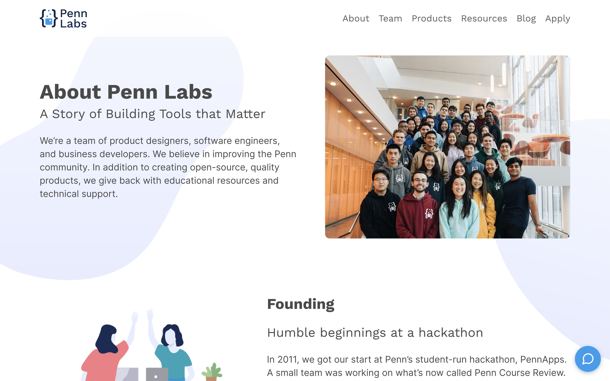

### Overview

Website for Penn Labs, an organization I have been a part of since my sophomore year at Penn. We build websites to help students navigate life at Penn, from courses to dining to studyspaces to housing.

---

#### About page

---

#### Penn Mobile product page

