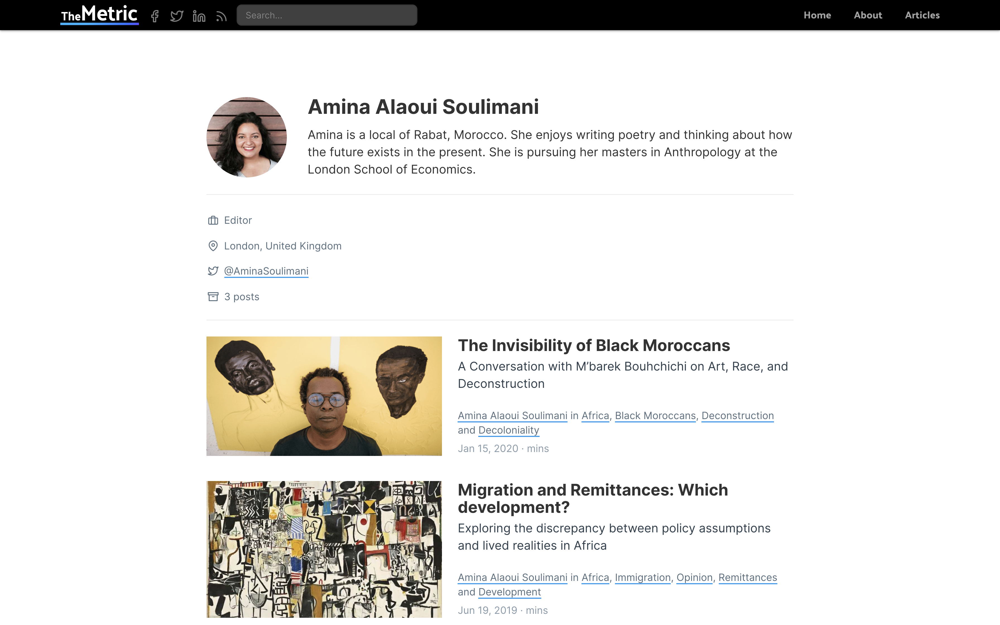

The new version of The Metric is a static site which sources data from a Ghost instance. Images are hosted in AWS, the static build is hosted on Netlify, the Ghost instance is hosted on Heroku. Search is handled via Lunr.

