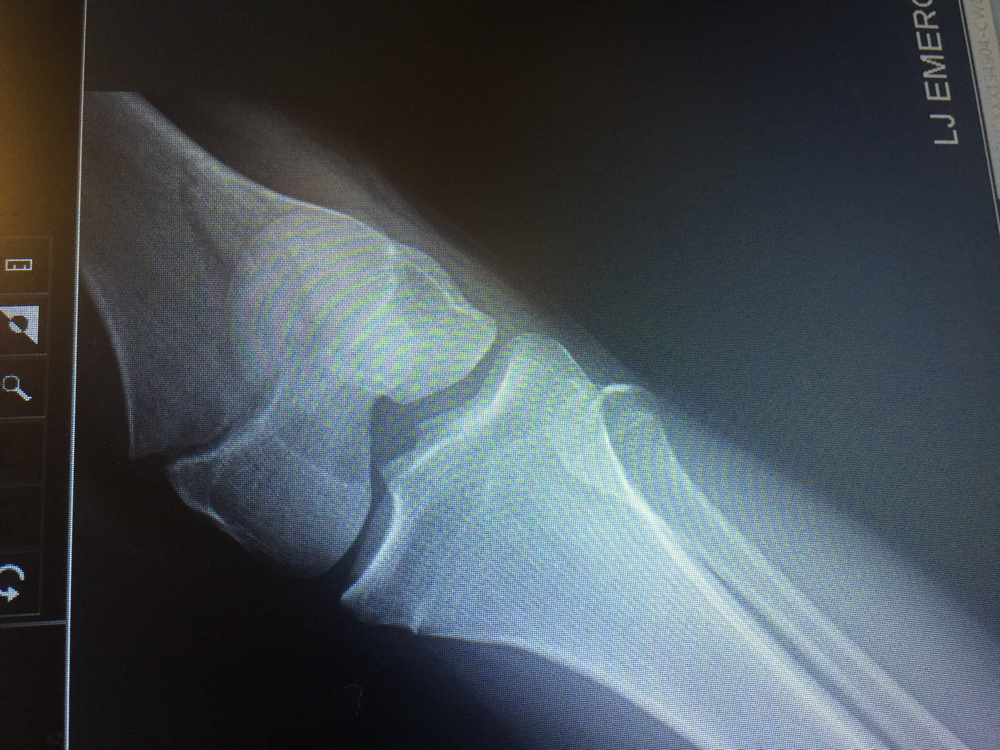
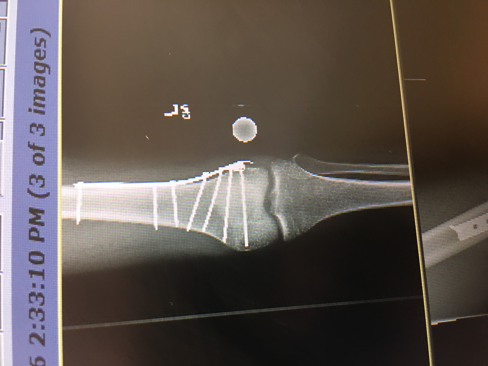
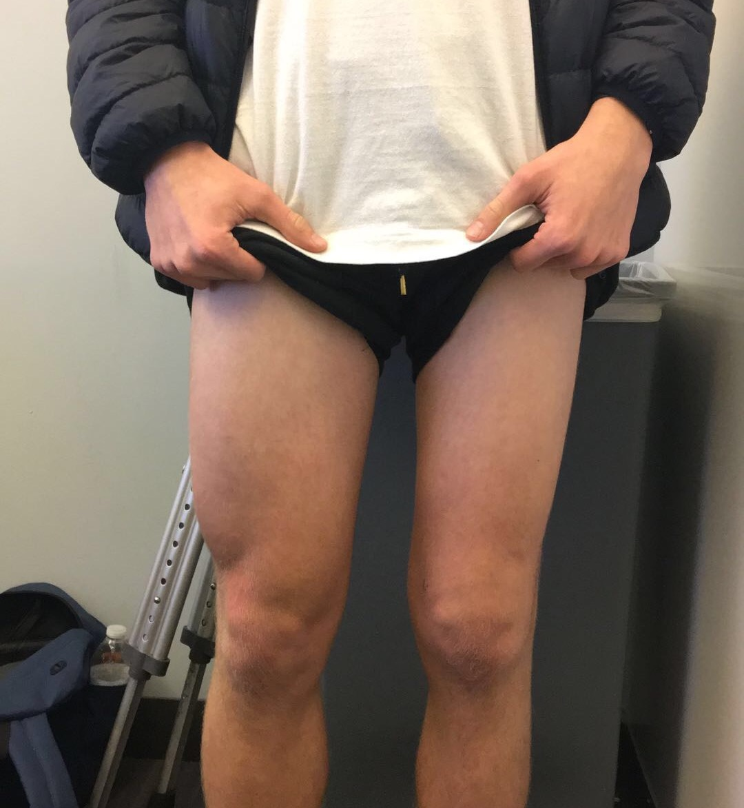

Just about a year ago today, I was on the sandy beaches of La Jolla enjoying my last few days before my freshman year at Penn with my mom, dad, grandma, and uncle. We were staying at a rental we’d visited every summer the past three years. Playing and lounging in the sun, this was a celebration at once of the past and of times to come—pretty momentous and also pretty damn fun.

Naturally, it was at this time that a particularly nefarious wave decided to hit me in just the perfect way to lodge my knee in the sand with enough leverage to hurt—a lot. A nice trip to the UCSD ER and 6 hours of waiting would later reveal that I’d broken my femur and would have to undergo 2 surgeries, 3 months without bearing weight on my leg, and 12 months of dull muscular and skeletal pain. Today, I’m left with a 10 inch scar up my left leg; a leg which is still 2 inches smaller in circumference than my right one (update: this is no longer the case).

Before and after X-rays, for your enjoyment:

Muscular atrophy. Nice.

I still went to school, crutched my way across campus at day and hoisted myself off of worn crutches into my bed at night. I stretched twice a day, went to PT twice a week, had to sit down twice to put on pants, and stood on one leg in the shower. It sucked but so too did it become my way of life. To a select few, I was even known as “crutch boy.” Most pertinently, I was by chance forced into this position and I made the choice to adapt as best I could.

Many people have been through far worse things of far greater pain, strife, and duration, though this incident forced me to better understand the importance of adaptability and change itself. The cliche that “the only constant in life is change” points to the fact that change, both expected and unexpected, is what defines your experiences. The places, jobs, and schools you choose to go to, the friends you make by chance or choice, and the difficult things forced upon you are what most strongly contribute to your life and who you become.

**My femur fracture showed me that change, although not always good, is always powerful.** Change is definitive and each change is an opportunity to learn, grow, and get better at dealing with change. Change can come at any time. Rather than avoiding change, find meaningful change and make the most of it, even when it’s forced on you.

I’ll be writing about this, specifically, over the coming weeks, and I’ll also be working to make my legs the same size. Stay tuned, and thanks for reading.

Update: I did not write more about this, though I've gotten my leg up to strength and I'm back to normal athletic activity. Thanks for the support.
