The past three and change months were very much a summer well spent; the people who surrounded me, the places I explored, and the projects I worked on bred an enriching, creative, experimental, and teaching summer season. I thought I'd take the time to reflect on and crystalize what it was I did:

#### I wrote code and drove decisions at PayPal.

Coming from a relatively small-scale startup in [Honey](https://joinhoney.com) last summer, I sought experience in an established tech powerhouse. I figured (and indeed discovered) that there was much to learn from the processes, protocols, and decision-making behind managing thousands of developers and hundreds of millions of customers globally. <u>I coordinated with teams across buildings and across continents to improve a product for users across the street and around the world. I think that's pretty cool.</u>

I worked on an agile team within the branded “Pay with PayPal” app. Our objective was to optimize the app through whatever means possible: A/B testing designs, presenting more granular information to the user, altering how we make API calls, etc. My primary project was to add the functionality to dynamically grant users discounts on their purchases. This project was flexible to its core: supporting fine-tuned user segments across all parts of the world with support for different languages and currencies. Ideally, I laid the groundwork for meaningful incentive marketing campaigns for years to come which truly delight PayPal's users.

Getting my project through the development pipeline was no small feat, as is the reality in any large company. I worked day in and day out not only to build out my piece of the puzzle, but also ensure other teams knew what I was doing and how my project fit into theirs. Informal, quick, and targetted meetings and Slack messages became my best friends. I had to hustle to get my code and vision to production.

The payments space is one of hot competition and global expansion; the winners who emerge must have superior user experiences, network breadth, and technical depth which convert prospective users into loyal customers. In giving thousands of users discounts off their purchases on behalf of PayPal, I hope to have pushed the company's aim to be a customer champion a small yet significant step forwards.

#### I hustled alongside Adam to get Riplo, our student-led software development studio, off the ground and moving with a full head of steam.

I love the process of building new projects. Each is an opportunity to work with new tech in a new context with a new team--you can iterate quickly, shatter assumptions, and strive to make something users will love. When actively building, I learn and grow the quickest.

Riplo is largely a formalization of a process that has been underway for a few years. The objective is to fill a market gap: my coworkers and I want to learn through building, and our clients want the next wave of web and mobile innovation.

If you want to learn more, get involved, or have something built, check out [our website.](https://www.riplo.io)

#### I worked on a fantastic team to bring Nalda to production.

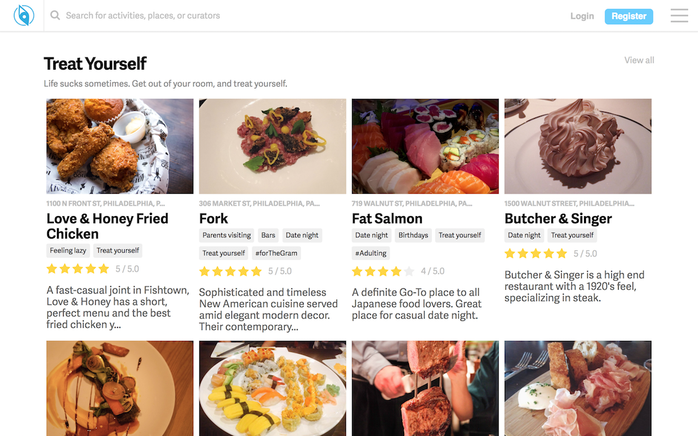

Nadla, is [Riplo's](https://www.riplo.io) first large-scale client. Nalda is a food, drink, and event discovery platform for college campuses. At the moment, we are focusing on creating a beautiful web experience for Penn, though more locations, features, and a mobile app are in the near-term pipeline.

We've worked closely with design and content teams to build for our target users. Where platforms like Yelp and Google give reviews and listings, Nalda aims to give opinions, recommendations, and immersive content which manifest as meaningful experiences.

#### I revamped The Metric with a more feature-rich, sleek, and opinionated UX which its content and content creators deserve.

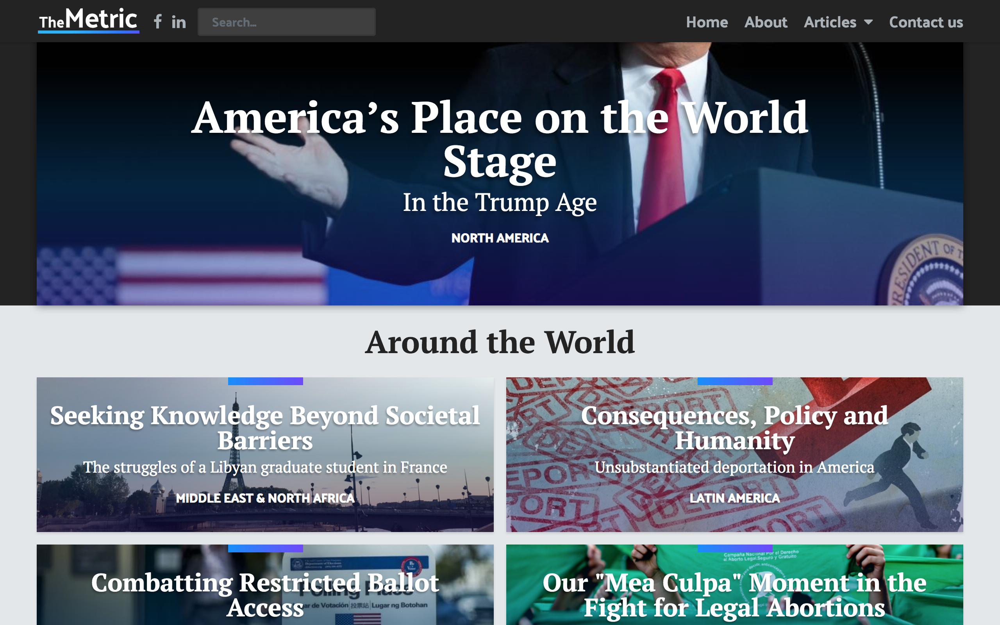

The Metric was just an idea presented to my by my friend Jason Kim two summers ago; a few weeks ago we surpassed 100 thousand global viewers. It's incredible to have been a part of such measurable progress. The team has built up a diverse and driven network of editors and creators which give unique, opinionated views on the world around us from perspectives you will struggle to find elsewhere.

I'm excited to keep building out new features to further enable our content creators to express themselves and to further enable our readers to understand these perspectives and give their own takes.

When you have a minute, I highly recommend reading some of these truly unique pieces from [our website.](https://www.themetric.org) Also, keep up with our content by liking us on [Facebook](https://www.facebook.com/TheMetricHQ/) or following us on [LinkedIn.](https://www.linkedin.com/company/themetrichq/)

#### I explored California, deciding to spend my time either very much at work or very much removed from it.

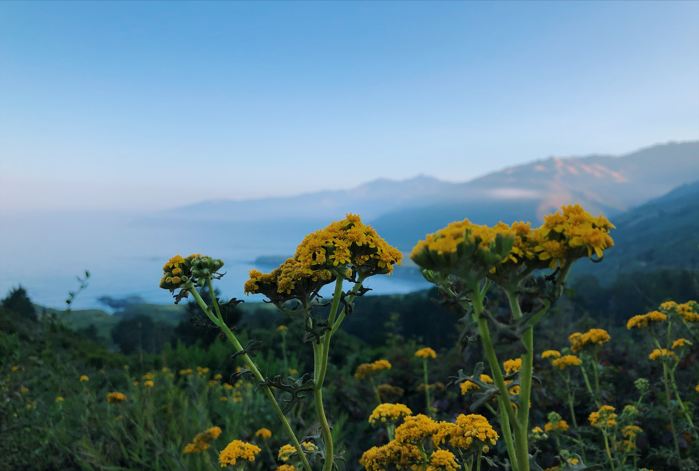
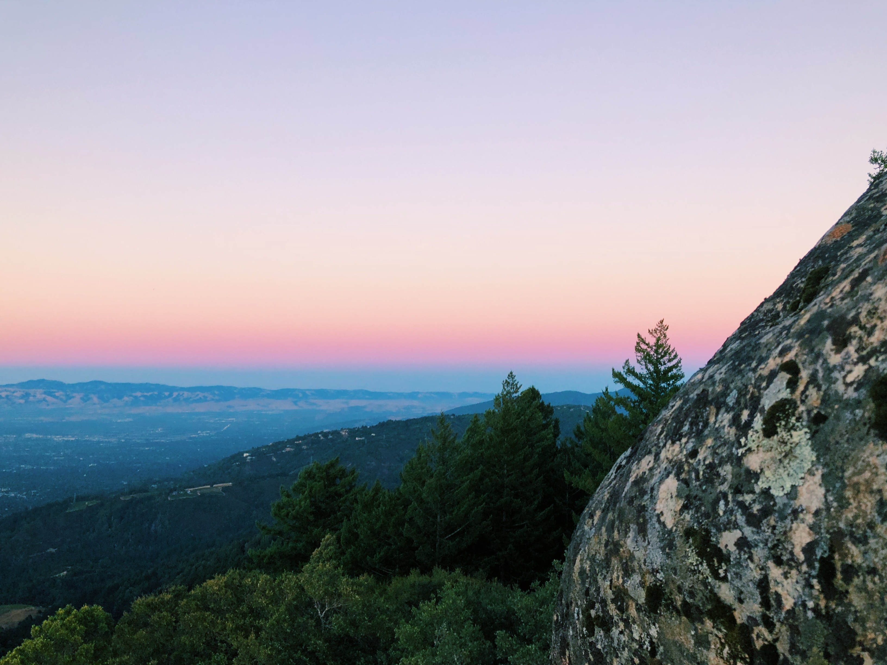
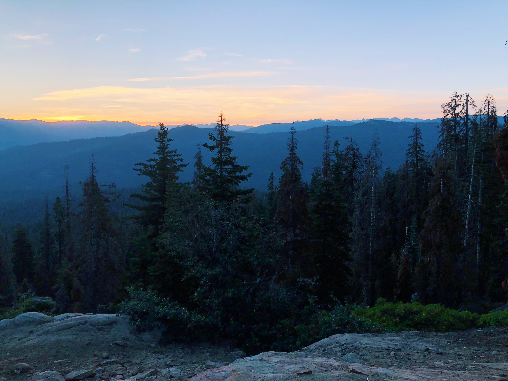
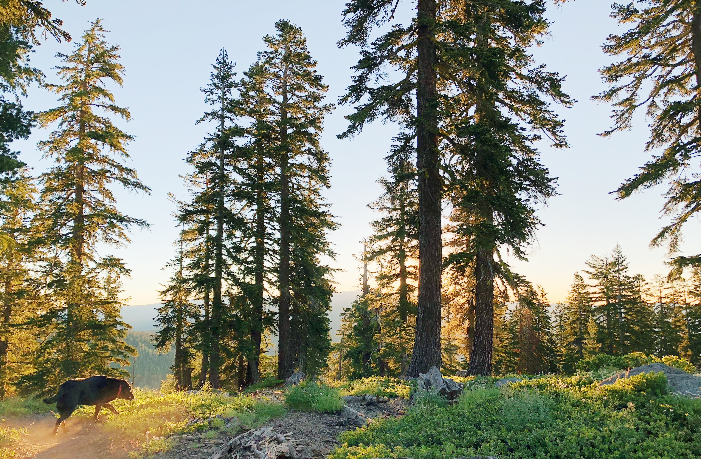
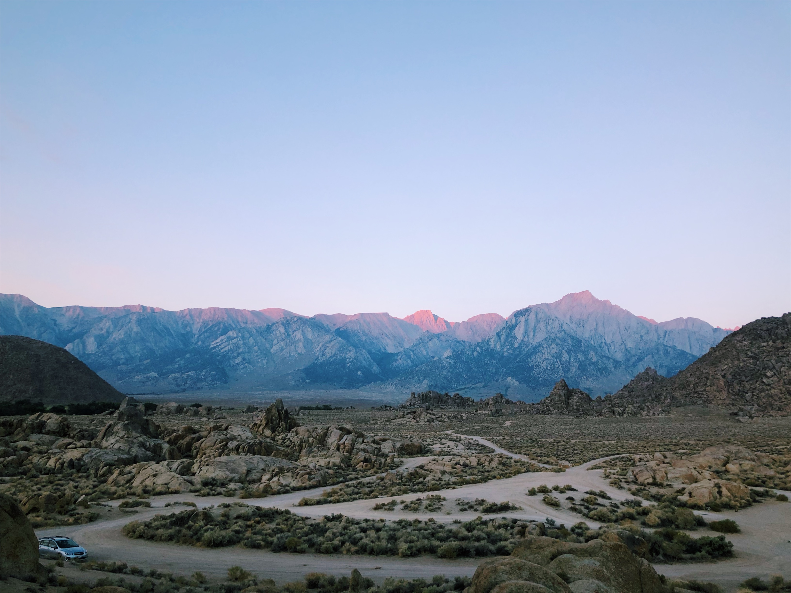
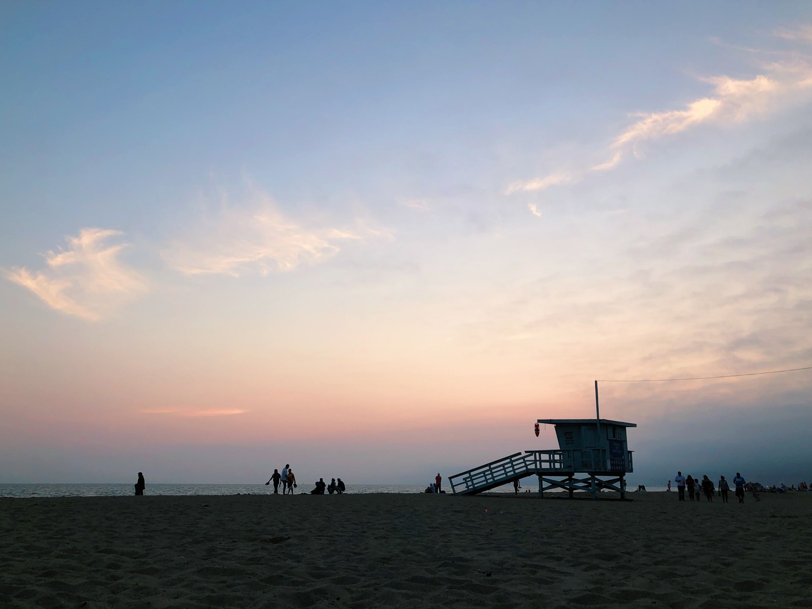
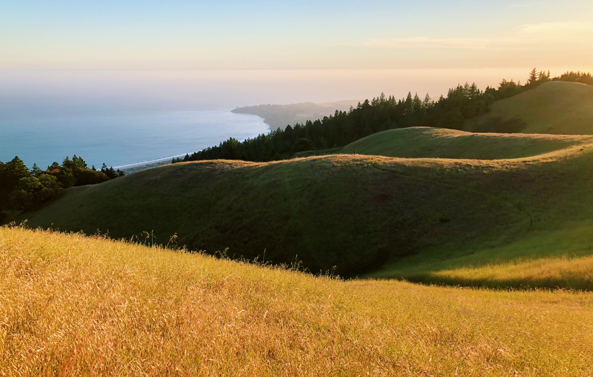
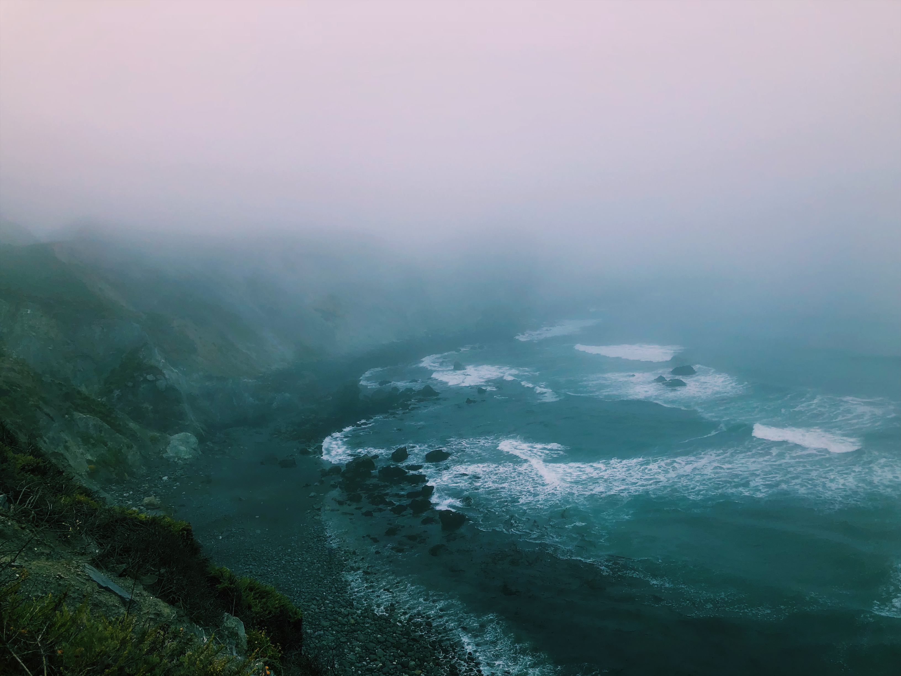
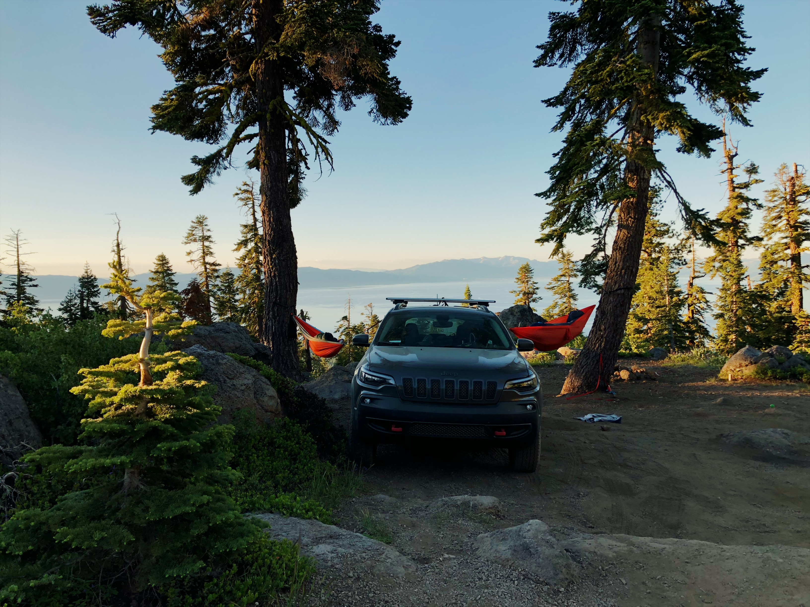

We're pretty fortunate that when we look at the world, we largely are pleased by what we see. It's almost odd that we can be paralyzed by the power of the sun rising or stunned by the scale of mountains. If you think about it, it doesn't _have_ to be that way.

I find myself happiest after an unplanned, dynamic, and draining weekend exploring. Few things are better than marvelling at the unique beauty around us and better understanding our role within it. In line with this, I made an effort to spend as many weekends engrossed in this type of exploration as possible.

There's a lot more to what makes humans happy and purposeful than computers, skyscrapers, and networks.

> All I got is a little bit of space and time drawing shapes and lines of the world we made   _Mac Miller on Small Worlds_

#### I learned an incredible amount from the people around me, and I am incredibly energized for year 3 at Penn.

My fellow PayPal interns are now some of my best friends. I'm excited to keep in touch and see where our adventures through tech and beyond take us. I spent the beginning and end of my summer at home catching up with high school friends and enjoying days in the sun with my mom, dad, brother, grandma, uncle, and dog.

I'm really fortunate to have the opportunity to lead the life I'm leading. This summer was an incredible mix of fun, travel, uncertainty, and belonging. Always keep in mind that when you look back on your experiences, you largely remember the triggers, transitions, peaks, and troughs the most. I'm fortunate to say that I have a lot of those.

Life is moving absurdly quickly—one moment I'm in Philly, the next LA, the next San Jose; one moment I'm building an incremental improvement on one of the world's largest fintech platforms, the next I'm scrapping together a company of my own, the next I'm navigating a dirt road high above Lake Tahoe, the next I'm studying harder than seemingly ever before to glean the most possible from my time at Penn...

I choose the word "absurdly" because I struggle to wrap my head around the progress and dynamism around me every day. I go to bed with my head spinning and wake up at once charged, confused, and passionate. I'm pretty troubled by many things going on in the world at large from the [environment](https://www.nature.com/articles/d41586-018-06876-2), to [Pittsburgh](https://en.wikipedia.org/wiki/Pittsburgh_synagogue_shooting), to [the border](https://www.nbcnews.com/news/us-news/sent-trump-soldiers-arrive-border-migrant-caravan-pushes-north-n930751), to [Syria](https://www.theguardian.com/world/2018/nov/03/idlib-jeremy-hunt-syria-russia-turkey), to [Brazil](https://www.washingtonpost.com/business/2018/11/02/democracy-is-danger-all-over-world-brazil-is-just-latest-example/?noredirect=on&utm_term=.a1131b9a6533). It's easy to feel powerless in light of things like this. And yet every day is a day to grow, learn, and hopefully have an impact on others or at least put yourself in a better position to have impact further down the line.
